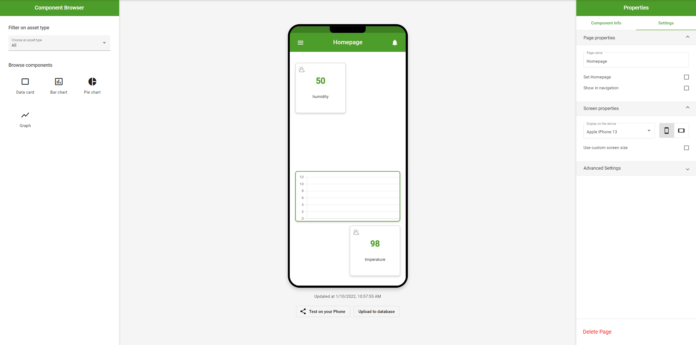

# OpenRemote App Designer

>  
> This project contains a Proof of Concept of a new App Designer, which uses OpenRemote version 3. 
> Developed by a group of students at Fontys University of Applied Sciences. 
>  
**Be aware that this is a Proof of Concept, so it is not fully optimized for others to host theirselves.**

Live Demo is hosted at https://bestnamever.github.io/seconditeration/home

 

## Features
- Grid App Builder to build your own App using Widgets (such as Charts, Labels and Buttons).
- Preview Screen which has flexible resolutions; phones, tablets, desktops, tv's, and more.
- Drag and Drop mechanism for adding new Widgets onto the App.
- Widget customization; edit its size, the data, or its label.
- Page customization; edit its name, or set it as a homepage.
- Phone Mirroring options to show the App on your phone.
- Uses OpenRemote HTTP API for syncing asset data.

## Screenshots
Live Demo at https://bestnamever.github.io/seconditeration/home

## Technology Details
Since this is a Proof of Concept there are not much similarities yet with OpenRemote's technologies. 
We are using [Angular CLI](https://github.com/angular/angular-cli) for building our Web Application, using Material Design for the design elements. 
Beside that, the Widgets (the Charts, labels etc) are available as Lit Components. 

A summary of our important dependencies:
- [Angular CLI](https://github.com/angular/angular-cli) v12.2.13
- [Angular Material Design](https://material.angular.io) v12.2.13 *(included in Angular)*
- [rxjs](https://www.npmjs.com/package/rxjs) v6.6.7 *(included in Angular)*
- [lit-element](https://lit.dev) v2.5.1
- [angular-gridster2](https://www.npmjs.com/package/angular-gridster2) v12.1.1
- [ng-qrcode](https://www.npmjs.com/package/ng-qrcode) v6.0.0

 
